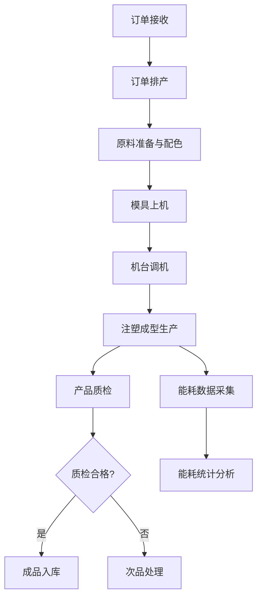

## 1. 产品概述

注塑车间塑料制品业务管理后台是一套面向注塑制造企业的生产管理系统，用于管理机台、模具和成型全流程。系统覆盖从订单排产到成品质检的完整生产链路，帮助企业实现生产数据可视化、生产流程标准化和能耗管理精细化。

- 产品定位：注塑车间生产管理数字化管理系统
- 目标用户：注塑厂生产管理人员、车间主任、质检人员、设备维护人员
- 核心价值：提升生产效率、降低次品率、优化能耗、质量追溯

## 2. 核心功能

### 2.1 用户角色

| 角色 | 注册方式 | 核心权限 |
|------|---------------------|------------------|
| 管理员 | 系统预置 | 全部模块管理、系统配置 |
| 生产主管 | 管理员创建 | 订单排产、生产监控、数据查看 |
| 车间操作员 | 管理员创建 | 机台调机、成型记录、模具操作 |
| 质检员 | 管理员创建 | 质检录入、质量报表查看 |

### 2.2 功能模块

1. **首页仪表板：生产概览、机台状态、关键指标统计
2. **订单排产模块：注塑订单管理、生产排程、订单进度追踪
3. **原料配色模块：塑料原料烘干管理、色母配色比例配置
4. **机台调机模块：注塑机调机参数、保压时间设定、模温机温度控制
5. **注塑成型模块：成型周期记录、生产过程监控
6. **产品质检模块：缩水飞边检查、尺寸抽检记录、质量统计
7. **模具管理模块：模具上下机记录、模具台账、模具维护
8. **能耗统计模块：注塑机能耗数据采集、能耗分析报表

### 2.3 页面详情

| 页面名称 | 模块名称 | 功能描述 |
|-----------|-------------|---------------------|
| 首页仪表板 | 生产概览 | 今日产量、机台运行率、合格率、能耗总览、待办事项 |
| 首页仪表板 | 机台状态 | 实时机台运行状态监控卡片 |
| 订单排产 | 订单列表 | 订单信息展示、状态筛选、搜索 |
| 订单排产 | 排产管理 | 甘特图展示排程、拖拽调整排期 |
| 订单排产 | 订单详情 | 订单信息、产品规格、生产进度 |
| 原料配色 | 原料管理 | 原料库存、原料烘干记录 |
| 原料配色 | 配色管理 | 色母配方配置、配色比例计算 |
| 机台调机 | 参数配置 | 注塑机参数设定、保压时间、模温机温度 |
| 机台调机 | 调机记录 | 历史调机参数历史 |
| 注塑成型 | 成型记录 | 成型周期、生产数据录入 |
| 注塑成型 | 生产监控 | 实时生产状态、产量统计 |
| 产品质检 | 外观检查 | 缩水、飞边、气泡等缺陷记录 |
| 产品质检 | 尺寸抽检 | 尺寸测量记录、公差判定 |
| 产品质检 | 质检报表 | 合格率统计、质量趋势 |
| 模具管理 | 模具台账 | 模具档案、使用次数、维护记录 |
| 模具管理 | 上下机记录 | 模具安装、拆卸记录 |
| 能耗统计 | 能耗概览 | 机台能耗数据、实时功率 |
| 能耗统计 | 能耗分析 | 能耗趋势、单位产品能耗、成本分析 |

## 3. 核心流程

## 4. 用户界面设计

### 4.1 设计风格
- 主色调：工业蓝 #1e40af（深蓝工业感）搭配琥珀橙 #f59e0b（工业警示色）
- 辅助色：深灰 slate 系列中性色系
- 按钮风格：圆角矩形、工业质感、悬停阴影效果
- 字体：思源黑体（工业简洁工业字体
- 布局风格：左侧导航+顶部状态栏+主内容区卡片式布局
- 图标风格：线性工业风格图标
- 整体风格：工业科技风、深色工业仪表盘风格、简洁高效

### 4.2 页面设计概览

| 页面名称 | 模块名称 | UI元素 |
|-----------|-------------|-------------|
| 首页仪表板 | 生产概览 | 统计卡片、数据可视化图表、状态指示灯、机台监控列表 |
| 业务页面 | 通用布局 | 侧边栏导航、面包屑、筛选工具栏、数据表格、表单弹窗 |
| 数据可视化 | 图表模块 | 折线图、柱状图、饼图、状态色块 |

### 4.3 响应式
- 桌面端优先设计，1440px 及以上最佳显示
- 支持平板横屏自适应
- 核心操作区域固定布局

