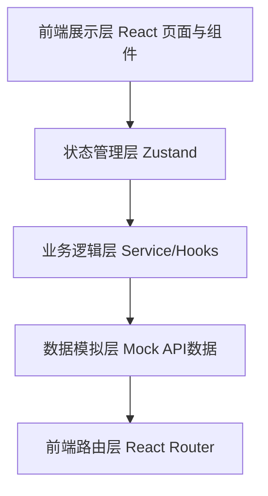
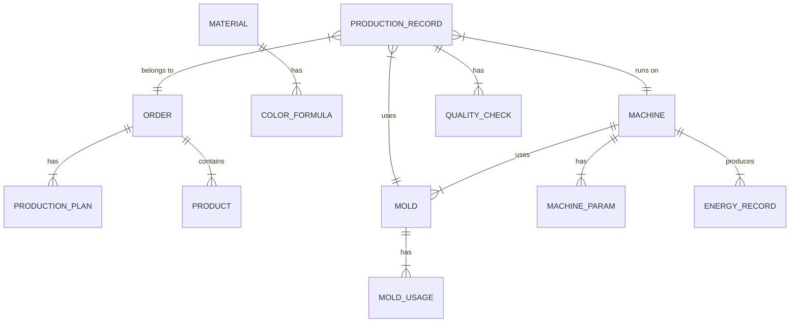

## 1. 架构设计



## 2. 技术说明

- 前端：React@18 + TypeScript + Vite
- UI框架：Tailwind CSS 3
- 状态管理：Zustand
- 路由：React Router DOM
- 图表：Recharts
- 图标：Lucide React
- 初始化工具：Vite
- 后端：无后端，纯前端Mock数据
- 数据：本地Mock数据模拟

## 3. 路由定义

| 路由 | 用途 |
|-------|---------|
| /dashboard | 首页仪表板 |
| /orders | 订单排产 |
| /materials | 原料配色 |
| /machines | 机台调机 |
| /molding | 注塑成型 |
| /quality | 产品质检 |
| /molds | 模具管理 |
| /energy | 能耗统计 |

## 4. 数据模型

### 4.1 数据模型定义



### 4.2 核心数据结构

```typescript
// 订单
interface Order {
  id: string;
  orderNo: string;
  productName: string;
  customer: string;
  quantity: number;
  completedQty: number;
  status: 'pending' | 'scheduled' | 'producing' | 'completed';
  scheduledDate: string;
  dueDate: string;
}

// 机台
interface Machine {
  id: string;
  machineNo: string;
  name: string;
  tonnage: number;
  status: 'running' | 'idle' | 'maintenance';
  currentMold?: string;
  currentOrder?: string;
}

// 模具
interface Mold {
  id: string;
  moldNo: string;
  name: string;
  cavities: number;
  usageCount: number;
  status: 'on_machine' | 'off_machine' | 'maintenance';
  lastMaintenance: string;
}

// 调机参数
interface MachineParam {
  id: string;
  machineId: string;
  injectionPressure: number;
  holdingPressure: number;
  holdingTime: number;
  moldTemp: number;
  cycleTime: number;
  effectiveDate: string;
}

// 原料
interface Material {
  id: string;
  name: string;
  type: string;
  stock: number;
  dryingTemp: number;
  dryingTime: number;
}

// 质检
interface QualityCheck {
  id: string;
  productionId: string;
  checkTime: string;
  shrinkage: boolean;
  flash: boolean;
  dimensions: { name: string; value: number; standard: number; tolerance: number }[];
  result: 'pass' | 'fail';
}

// 能耗记录
interface EnergyRecord {
  id: string;
  machineId: string;
  timestamp: string;
  power: number;
  energy: number;
}
```

